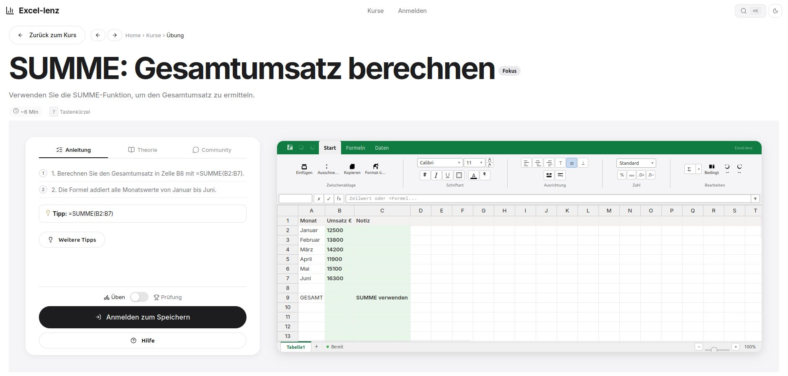

# Excel-lenz

[](https://github.com) [](https://github.com) [](https://www.typescriptlang.org/) [](https://react.dev/) [](https://expressjs.com/) [](https://www.docker.com/) [](LICENSE) [](docs/ARCHITECTURE.md)

> Interaktives Excel-Lernportal — Praxisorientiertes Training mit direktem Feedback und adaptiven Lernpfaden.

---

## Über das Projekt

Excel-lenz ist eine browserbasierte Lernplattform, die Excel-Übungen in einer realistischen Tabellenkalkulationsumgebung bereitstellt. Statt passiver Video-Tutorials oder statischer PDFs arbeitet der Lernende direkt in einem vollständigen Excel-Simulator — mit Ribbon-Interface, Formel-Engine und automatischer Korrektur.

### Warum Excel-lenz?

Traditionelles Excel-Lernen leidet unter drei Problemen: **kein direktes Feedback** (man weiß nicht, ob die Lösung stimmt), **kein Praxisbezug** (Theorie ohne Anwendung), und **keine Personalisierung** (alle machen das Gleiche). Excel-lenz adressiert alle drei:

| Prinzip | Umsetzung |
|---------|-----------|
| **Learning by Doing** | Jede Übung findet in einem echten Excel-Simulator statt — mit Formeln, Formatierung und Diagrammen |
| **Sofortiges Feedback** | Automatische Zell-für-Zell-Korrektur zeigt genau, was falsch ist — mit Hinweisen zur Verbesserung |
| **Adaptive Lernpfade** | Spaced Repetition und Fähigkeitsanalyse passen die Übungsempfehlungen individuell an |
| **Micro-Learning** | Übungen sind in 5-15 Minuten abschließbar — ideal für den Arbeitsalltag |

<br>



### Für wen ist Excel-lenz?

- **Berufstätige**, die Excel-Kenntnisse für ihren Job benötigen
- **Studierende** in wirtschafts- oder datenorientierten Studiengängen
- **Quereinsteiger**, die eine strukturierte Excel-Ausbildung suchen
- **Dozenten und Trainer**, die Übungen zuweisen und Fortschritte verfolgen möchten
- **Unternehmen**, die eine skalierbare Excel-Schulung für Mitarbeiter benötigen

### Wie funktioniert das Lernen?

```
Kurs wählen → Übung starten → Im Simulator arbeiten → Korrigieren lassen → Nächste Übung
                    ↑                                                      │
                    └────────── Spaced Repetition (gezielt wiederholen) ←──┘
```

Jede Übung folgt demselben didaktischen Aufbau:
1. **Anleitung** — Schritt-für-Schritt-Instruktionen mit konkreten Aufgaben
2. **Theorie** — Kompakte Erläuterung der relevanten Excel-Konzepte
3. **Praxis** — Bearbeitung im integrierten Excel-Simulator
4. **Feedback** — Automatische Korrektur mit zellscharfer Fehlermarkierung
5. **Hinweise** — Vier Eskalationsstufen: allgemeiner Tipp → Funktionshinweis → Lösungsskizze → Volle Lösung

---

## Kursstruktur

Die Plattform umfasst vier aufeinander aufbauende Kurse, die vom absoluten Excel-Anfänger bis zum fortgeschrittenen Datenanalysten führen:

| Kurs | Niveau | Inhalte |
|------|--------|---------|
| **Excel für Anfänger** | Einsteiger | Zellen, Formeln, SUMME, MITTELWERT, Formatierung, einfache Diagramme |
| **Datenanalyse & Statistik** | Mittel | WENN, SVERWEIS, XVERWEIS, Pivot-Tabellen, Filter, Sortieren |
| **Fortgeschrittene Techniken** | Fortgeschritten | Bedingte Formatierung, Datenvalidierung, komplexe Formeln, Diagramme |
| **Datenbank & Business Intelligence** | Experte | Gemischte Bezüge, DATUM, TEXT, SVERWEIS mit Mehrfachkriterien, Datenbankfunktionen (DSUMME, DMITTELWERT, BDSUMMA) |

---

## Kernfunktionen

Die Plattform bietet einen vollständigen Excel-Simulator mit Werkzeugen für effizientes Lernen und Lehren.

| Bereich | Details |
|---------|---------|
| **Excel-Simulator** | Handsontable 18 + HyperFormula 3 — Ribbon-Interface, Formelleiste mit Autovervollständigung und Bereichsanzeige, Zellformatierung, bedingte Formatierung, Zoom, Sortierung, Filter, Sparklines, Zielwertsuche |
| **Übungssystem** | Geführte Aufgaben mit schrittweisen Instruktionen, progressiven Hinweisen (4 Stufen) und automatischer Korrektur mit Zell-für-Zell-Feedback |
| **Prüfungsmodus** | Zeitgesteuerte Assessments mit Countdown-Timer, automatischer Abgabe und geschützter Umgebung |
| **Datenwerkzeuge** | SVG-Diagramme (Balken/Linie), Datenvalidierung mit benutzerdefinierten Regeln, interaktive Pivot-Tabellen |
| **Adaptives Lernen** | Personalisierte Übungsempfehlungen basierend auf Spaced Repetition und Fähigkeitsanalyse |
| **Lehrer-Panel** | Verwaltung von Kursen und Übungen, Schülerübersicht mit Fortschrittsanalyse |
| **Barrierefreiheit** | Screenreader-Unterstützung, Tastaturnavigation, Fokus-Modus, reduzierte Bewegung |
| **Dark Mode** | Vollständige Dark-Mode-Unterstützung mit CSS-Custom-Properties |

---

## Schnellstart

In drei Befehlen zur lauffähigen Entwicklungsumgebung.

```bash
# 1. Abhängigkeiten installieren
npm run install:all

# 2. Datenbank initialisieren
npm run db:seed

# 3. Entwicklungsumgebung starten
npm run dev
```

| Dienst | Adresse |
|--------|---------|
| Frontend | http://localhost:5173 |
| Backend API | http://localhost:3001 |

---

## Architektur

Klassische Three-Tier-Architektur mit REST-API und JWT-Authentifizierung.

| Schicht | Technologie |
|---------|-------------|
| **Client** | React 19 · TypeScript 7 · Vite 6 · Handsontable 18 · HyperFormula 3 |
| **API** | HTTP REST · JWT Bearer Auth |
| **Server** | Express 4 · better-sqlite3 · tsx · Auth · Courses · Exercises |
| **Datenbank** | SQLite (WAL mode) |

---

## Technologie-Stack

Bewährte Open-Source-Technologien für Stabilität und Erweiterbarkeit.

| Schicht | Technologie |
|---------|-------------|
| **Spreadsheet** | Handsontable 18 · HyperFormula 3 |
| **Frontend** | React 19 · TypeScript 7 · Vite 6 |
| **Backend** | Express 4.21 · TypeScript · tsx |
| **Datenbank** | better-sqlite3 13 (Entwicklung) |
| **Authentifizierung** | JWT (Bearer Tokens) · bcryptjs |
| **Internationalisierung** | HyperFormula DE/EN-Formelübersetzung |
| **Visualisierung** | SVG-Charts (nativ) · react-pivottable |
| **Deployment** | Docker · Docker Compose · Nginx |

---

## Projektstruktur

Monorepo mit klar getrennten Verantwortlichkeiten zwischen Frontend und Backend.

```
excellenz/
├── frontend/                    # React SPA — Port 5173
│   └── src/
│       ├── pages/               # Exercise · Courses · CourseDetail · Dashboard · TeacherPanel · StudentPanel
│       ├── components/
│       │   ├── spreadsheet/     # Handsontable · Ribbon · FormulaBar · Charts · Validation · Pivot
│       │   ├── navigation/      # UserMenu · CommandPalette · Breadcrumbs · MobileDrawer
│       │   └── gamification/    # DailyGoal · Notifications
│       ├── context/             # Auth · Theme
│       └── hooks/               # useExamTimer · useAutosave
│
├── backend/                     # Express API — Port 3001
│   └── src/
│       ├── routes/              # auth · courses · exercises · gamification · adaptive · teacher · community · enterprise
│       ├── db/                  # SQLite · Seed-Daten
│       └── middleware/          # JWT-Authentifizierung
│
├── docs/                        # Dokumentation & Screenshots
├── docker-compose.yml           # Produktionsumgebung
├── Dockerfile                   # Multi-Stage Build
├── nginx.conf                   # Reverse Proxy
└── .github/                     # Copilot · Agent-Konfiguration
```

---

## Entwicklung

Lokale Entwicklungsumgebung mit Hot-Reload für schnelle Iterationen.

```bash
# Einzelne Dienste starten
cd backend  && npm run dev    # API auf :3001
cd frontend && npm run dev    # SPA auf :5173

# Statische Analyse
cd frontend && npx tsc --noEmit

# Produktions-Build
cd frontend && npm run build
```

> Ausführliche technische Dokumentation: [ARCHITECTURE.md](docs/ARCHITECTURE.md)  
> Abhängigkeiten: [package-lock.json](package-lock.json)

---

## Produktion

Docker-basiertes Deployment mit Nginx Reverse Proxy.

```bash
cp .env.example .env
# JWT_SECRET mit sicherem Wert ersetzen
docker compose up -d --build
```

Die Anwendung ist anschließend unter `http://localhost` erreichbar.

---

## Lizenz

Dieses Projekt ist unter der AGPLv3-Lizenz veröffentlicht. Siehe [LICENSE](LICENSE) für den vollständigen Lizenztext.

---

<p align="center">
  <sub>Excel-lenz — Lernen durch Praxis.</sub>
</p>


