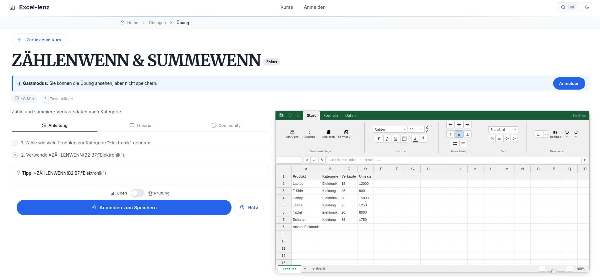

# Excel-lenz

> Interaktives Excel-Lernportal — Praxisorientiertes Training mit direktem Feedback und adaptiven Lernpfaden.

[](https://www.typescriptlang.org/)
[](https://react.dev/)
[](https://expressjs.com/)
[](https://www.docker.com/)
[](LICENSE)

<br>



<br>

## Über das Projekt

Excel-lenz ist eine browserbasierte Lernplattform, die Excel-Übungen in einer realistischen Tabellenkalkulationsumgebung bereitstellt. Benutzer arbeiten mit einem vollständigen Excel-Simulator — inklusive Formel-Engine, Ribbon-Interface und automatischer Korrektur.

Die Plattform umfasst vier aufeinander aufbauende Kurse mit Übungen zu Formeln, Funktionen, Formatierung, Datenanalyse und Diagrammen.

---

## Kernfunktionen

| Bereich | Details |
|---------|---------|
| **Excel-Simulator** | Handsontable 14 + HyperFormula 3 — Ribbon-Interface, Formelleiste mit Autovervollständigung, Zellformatierung, bedingte Formatierung, Zoom, Sortierung, Filter |
| **Übungssystem** | Geführte Aufgaben mit schrittweisen Instruktionen, progressiven Hinweisen (4 Stufen) und automatischer Korrektur mit Zell-für-Zell-Feedback |
| **Prüfungsmodus** | Zeitgesteuerte Assessments mit Countdown-Timer, automatischer Abgabe und geschützter Umgebung |
| **Datenwerkzeuge** | SVG-Diagramme (Balken/Linie), Datenvalidierung mit benutzerdefinierten Regeln, interaktive Pivot-Tabellen |
| **Adaptives Lernen** | Personalisierte Übungsempfehlungen basierend auf Spaced Repetition und Fähigkeitsanalyse |
| **Gamification** | Erfahrungspunkte, Abzeichen, tägliche Ziele, Bestenlisten und Fortschrittsdiagramme |
| **Lehrer-Panel** | Verwaltung von Kursen und Übungen, Schülerübersicht mit Fortschrittsanalyse |
| **Barrierefreiheit** | Screenreader-Unterstützung, Tastaturnavigation, Fokus-Modus, reduzierte Bewegung |
| **Dark Mode** | Vollständige Dark-Mode-Unterstützung mit CSS-Custom-Properties |
| **Mehrsprachig** | Deutsche Oberfläche, HyperFormula mit DE/EN-Formelübersetzung |

---

## Schnellstart

```bash
# 1. Abhängigkeiten installieren
npm run install:all

# 2. Datenbank initialisieren
npm run db:seed

# 3. Entwicklungsumgebung starten
npm run dev
```

| Dienst | Adresse |
|--------|---------|
| Frontend | http://localhost:5173 |
| Backend API | http://localhost:3001 |

---

## Architektur

```
┌─────────────────────────────────────────────┐
│  Client (Browser)                           │
│  React 18 · TypeScript · Vite               │
│  Handsontable · HyperFormula · Lucide       │
├─────────────────────────────────────────────┤
│  HTTP REST · JWT Bearer Auth                │
├─────────────────────────────────────────────┤
│  Server (Node.js)                           │
│  Express 4 · better-sqlite3 · tsx           │
│  Auth · Courses · Exercises · Gamification  │
├─────────────────────────────────────────────┤
│  Datenbank                                  │
│  SQLite (dev) / PostgreSQL (prod)           │
└─────────────────────────────────────────────┘
```

---

## Technologie-Stack

| Schicht | Technologie |
|---------|-------------|
| **Spreadsheet** | Handsontable 14.6 · HyperFormula 3.3 |
| **Frontend** | React 18.3 · TypeScript 5.6 · Vite 6 |
| **Backend** | Express 4.21 · TypeScript · tsx |
| **Datenbank** | better-sqlite3 11 (Entwicklung) · PostgreSQL 16 (Produktion) |
| **Authentifizierung** | JWT (Bearer Tokens) · bcryptjs |
| **Internationalisierung** | HyperFormula DE/EN-Formelübersetzung |
| **Visualisierung** | SVG-Charts (nativ) · react-pivottable |
| **Deployment** | Docker · Docker Compose · Nginx |

---

## Projektstruktur

```
excellenz/
├── frontend/                    # React SPA — Port 5173
│   └── src/
│       ├── pages/               # Exercise · Courses · CourseDetail · Dashboard · TeacherPanel
│       ├── components/
│       │   ├── spreadsheet/     # Handsontable · Ribbon · FormulaBar · Charts · Validation · Pivot
│       │   ├── navigation/      # UserMenu · CommandPalette · Breadcrumbs · MobileDrawer
│       │   └── gamification/    # DailyGoal · Notifications
│       ├── context/             # Auth · Theme
│       └── hooks/               # useExamTimer · useAutosave
│
├── backend/                     # Express API — Port 3001
│   └── src/
│       ├── routes/              # auth · courses · exercises · gamification · adaptive · teacher · community · enterprise
│       ├── db/                  # SQLite · Seed-Daten
│       └── middleware/          # JWT-Authentifizierung
│
├── docs/                        # Dokumentation & Screenshots
├── docker-compose.yml           # Produktionsumgebung
├── Dockerfile                   # Multi-Stage Build
├── nginx.conf                   # Reverse Proxy
└── .github/                     # Copilot · Agent-Konfiguration
```

---

## Entwicklung

```bash
# Einzelne Dienste starten
cd backend  && npm run dev    # API auf :3001
cd frontend && npm run dev    # SPA auf :5173

# Statische Analyse
cd frontend && npx tsc --noEmit

# Produktions-Build
cd frontend && npm run build
```

---

## Produktion

```bash
cp .env.example .env
# JWT_SECRET mit sicherem Wert ersetzen
docker compose up -d --build
```

Die Anwendung ist anschließend unter `http://localhost` erreichbar.

---

## Lizenz

Dieses Projekt ist unter der MIT-Lizenz veröffentlicht. Siehe [LICENSE](LICENSE) für den vollständigen Lizenztext.

---

<p align="center">
  <sub>Excel-lenz — Lernen durch Praxis.</sub>
</p>

