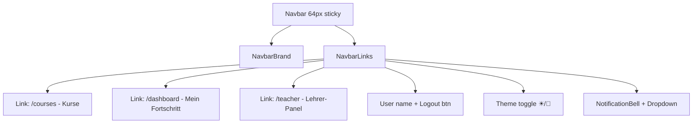

# Excel-lenz — Propuesta de Rediseño de la Barra de Navegación Superior

> **Fecha**: 2026-07-31  
> **Alcance**: Análisis en profundidad + propuestas de mejora extensas  
> **Autor**: Revisión de código + diseño  

---

## Índice

1. [Resumen Ejecutivo](#1-resumen-ejecutivo)
2. [Análisis del Estado Actual](#2-análisis-del-estado-actual)
3. [Problemas Detectados](#3-problemas-detectados)
4. [Propuestas de Mejora](#4-propuestas-de-mejora)
   - [4.1 Nivel Visual](#41-nivel-visual)
   - [4.2 Nivel Funcional](#42-nivel-funcional)
   - [4.3 Nivel Estructural](#43-nivel-estructural)
5. [Plan de Implementación Recomendado](#5-plan-de-implementación-recomendado)
6. [Diseño Detallado de la Solución](#6-diseño-detallado-de-la-solución)
7. [Anexo Técnico](#7-anexo-técnico)

---

## 1. Resumen Ejecutivo

La barra de navegación actual de Excel-lenz es **funcional pero minimalista**. Soporta navegación básica, autenticación, cambio de tema y notificaciones. Sin embargo, carece de elementos visuales modernos, no escala bien en móvil, y desaprovecha oportunidades de engagement y descubrimiento de funcionalidades.

**Hallazgo clave**: La navbar tiene solo **64px de altura** con glassmorphism sutil. En móvil simplemente encoge los links — no hay menú hamburguesa. No existe búsqueda global, selector de idioma, ni avatar de usuario con dropdown. El indicador de ruta activa está definido en CSS pero **no se aplica en el JSX**.

---

## 2. Análisis del Estado Actual

### 2.1 Estructura del Componente



### 2.2 CSS Actual

| Propiedad | Valor | Observación |
|-----------|-------|-------------|
| `height` | `64px` | Adecuado |
| `position` | `sticky; top: 0; z-index: 100` | Correcto |
| `background` | `rgba(255,255,255,0.85)` | Glassmorphism sutil |
| `backdrop-filter` | `blur(16px)` | Moderno |
| `padding` | `0 32px` | Correcto |
| `border-bottom` | `1px solid var(--border)` | Correcto |
| `justify-content` | `space-between` | Correcto |

**Modo oscuro**: `background: rgba(22,27,34,0.85)` + `backdrop-filter: blur(20px)` — bien implementado.

### 2.3 Páginas y Rutas

| Ruta | Página | ¿En navbar? | Notas |
|------|--------|-------------|-------|
| `/` | Home | ❌ (solo logo) | Landing pública |
| `/login` | Login | Solo si no logueado | Texto "Anmelden" |
| `/register` | Register | ❌ | Solo accesible desde Login |
| `/courses` | Courses | ✅ | "Kurse" |
| `/courses/:id` | CourseDetail | ❌ | Navegación interna |
| `/exercises/:id` | Exercise | ❌ | Tiene focus mode que oculta navbar |
| `/dashboard` | Dashboard | ✅ (si logueado) | "Mein Fortschritt" |
| `/teacher` | TeacherPanel | ✅ (si teacher) | "Lehrer-Panel" |
| `*` | NotFound | ❌ | 404 |

### 2.4 Dependencias Relevantes

- **lucide-react** `^1.28.0` — iconos (ya instalado)
- **react-router-dom** `^6.28.0` — routing (ya instalado)
- **react** `^18.3.1` — sin problemas de versión
- **NO** react-i18next instalado → la localización mencionada en docs no está activa

### 2.5 Responsive Actual

```css
/* Tablet (≤768px) */
.navbar { padding: 0 12px; height: 56px; }
.navbar-brand { font-size: 1.1rem; }
.navbar-links a { padding: 6px 8px; font-size: 0.82rem; }

/* Mobile (≤480px) */
.navbar-links a { padding: 4px 6px; font-size: 0.78rem; }
.navbar-user { display: none; }  /* ← se oculta nombre de usuario */
```

**Problema**: No hay menú hamburguesa. Los links se comprimen hasta ser ilegibles.

---

## 3. Problemas Detectados

### 🔴 Críticos

| # | Problema | Impacto | Archivo |
|---|----------|---------|---------|
| P1 | **Sin menú responsive** — en móvil los links se encogen pero no colapsan | Usabilidad móvil rota | `App.tsx:44-66` |
| P2 | **`.active` no aplicado** — CSS define `.navbar-links a.active` pero el JSX no usa `NavLink` ni aplica la clase | Los usuarios no saben dónde están | `App.tsx:48-60` |
| P3 | **Sin buscador** — 167 ejercicios en 4 cursos y no hay forma de buscar | Descubribilidad pobre | N/A |

### 🟡 Medios

| # | Problema | Impacto | Archivo |
|---|----------|---------|---------|
| P4 | **Texto "Anmelden" vs botón "Abmelden"** — estilos inconsistentes | Estética | `App.tsx:50,56` |
| P5 | **Username como `<span>`** sin avatar ni dropdown | Parece amateur | `App.tsx:54` |
| P6 | **Sin breadcrumbs** — en `/exercises/:id` no hay referencia a qué curso pertenece | Desorientación | N/A |
| P7 | **Sin selector de idioma** — la documentación menciona DE/ES pero no hay UI | Funcionalidad fantasma | N/A |
| P8 | **Focus mode oculta navbar** pero no hay botón para salir | Usabilidad | `index.css:2883` |

### 🟢 Menores

| # | Problema | Impacto | Archivo |
|---|----------|---------|---------|
| P9 | **Logo fijo a la izquierda** — en pantallas grandes hay mucho espacio vacío | Estética | `App.tsx:40` |
| P10 | **Sin indicador de progreso global** — no se ve el avance en el curso actual | Engagement | N/A |
| P11 | **Sin tooltip de atajos** — `?` no muestra ayuda de teclado | Descubribilidad | N/A |
| P12 | **Sin animación de transición** entre rutas | Estática | N/A |

---

## 4. Propuestas de Mejora

### 4.1 Nivel Visual

#### V1 — Avatar de Usuario con Dropdown ⭐ *Recomendado*

**Estado actual**: `<span className="navbar-user"><User size={14} />{user.name}</span>`

**Propuesta**: Avatar circular con las iniciales del usuario (o Gravatar) + dropdown al hacer clic.

```
┌─────────────────────────────────┐
│  [JD]  John Doe            ▼   │
├─────────────────────────────────┤
│  👤  Mi Perfil                 │
│  📊  Mi Progreso               │
│  ⚙️   Configuración            │
│  ❓  Ayuda (?)                 │
│  ─────────────────────────     │
│  🚪  Cerrar Sesión             │
└─────────────────────────────────┘
```

**Archivos a modificar**: `App.tsx`, `index.css`  
**Esfuerzo**: 2-3h  
**Prioridad**: 🔴 Alta

#### V2 — Indicador de Ruta Activa ⭐ *Recomendado*

**Estado actual**: CSS existe (`.navbar-links a.active`) pero no se usa.

**Propuesta**: Cambiar `<Link>` por `<NavLink>` de react-router-dom, que aplica automáticamente la clase `.active`.

```tsx
// Antes
<Link to="/courses">Kurse</Link>

// Después
<NavLink to="/courses" end>Kurse</NavLink>
```

Además, añadir un indicador visual de pestaña activa:

```css
.navbar-links a.active {
  color: var(--tertiary);
  background: var(--tertiary-light);
  position: relative;
}
.navbar-links a.active::after {
  content: '';
  position: absolute;
  bottom: -12px;
  left: 50%;
  transform: translateX(-50%);
  width: 20px;
  height: 3px;
  background: var(--tertiary);
  border-radius: 3px 3px 0 0;
}
```

**Archivos a modificar**: `App.tsx`, `index.css`  
**Esfuerzo**: 30min  
**Prioridad**: 🔴 Alta

#### V3 — Efecto Glass + Gradiente Mejorado

**Propuesta**: Añadir un gradiente sutil en hover y micro-interacciones.

```css
.navbar {
  /* Añadir gradiente top */
  background: linear-gradient(
    180deg,
    rgba(255,255,255,0.95) 0%,
    rgba(255,255,255,0.85) 100%
  );
}
/* Borde inferior con gradiente accent */
.navbar::after {
  content: '';
  position: absolute;
  bottom: 0; left: 0; right: 0;
  height: 2px;
  background: linear-gradient(90deg,
    transparent 0%,
    var(--tertiary) 20%,
    var(--accent) 80%,
    transparent 100%
  );
  opacity: 0;
  transition: opacity 0.3s;
}
.navbar:hover::after {
  opacity: 0.4; /* sutil */
}
```

**Archivos a modificar**: `index.css`  
**Esfuerzo**: 30min  
**Prioridad**: 🟡 Media

---

### 4.2 Nivel Funcional

#### F1 — Buscador Global (⌘K / Ctrl+K) ⭐ *Recomendado*

**Propuesta**: Modal de búsqueda con atajo de teclado, al estilo Spotlight/Command Palette.

```
┌──────────────────────────────────────────┐
│  🔍  Buscar ejercicios, cursos...        │
│  ─────────────────────────────────────   │
│  📝  SUMME() — Excel für Anfänger       │
│  📝  SVERWEIS() — Fortgeschrittene...    │
│  📝  Pivot-Tabellen — Datenanalyse       │
│  ─────────────────────────────────────   │
│  📚  Excel für Anfänger (Kurs)           │
│  📚  Fortgeschrittene Techniken (Kurs)   │
│  ─────────────────────────────────────   │
│  ⌘K  para abrir  ·  ↑↓  navegar  ·  ↵  abrir  ·  Esc  cerrar │
└──────────────────────────────────────────┘
```

**Datos necesarios**: Lista plana de ejercicios + cursos (ya disponible vía API `/courses`).

**Implementación**:
1. Componente `CommandPalette.tsx` con `useEffect` para listener de `Ctrl+K` / `⌘K`
2. Fetch de cursos+ejercicios al abrir, caché en `useRef`
3. Filtrado por título con `fuse.js` (búsqueda difusa) o `String.includes()` simple
4. Navegación con `useNavigate()` al seleccionar

**Archivos a crear**: `frontend/src/components/navigation/CommandPalette.tsx`  
**Archivos a modificar**: `App.tsx`, `index.css`  
**Esfuerzo**: 4-6h  
**Prioridad**: 🔴 Alta

#### F2 — Menú Hamburguesa Responsive ⭐ *Recomendado*

**Propuesta**: En pantallas ≤768px, colapsar los links en un drawer lateral con animación.

```
┌──────────────────┐
│ [☰]  Excel-lenz  │  ← mobile navbar
└──────────────────┘

┌──────────────────┐
│ ✕     Menú       │
│ ──────────────── │
│ 📚  Kurse        │
│ 📊  Mein Fortsch. │
│ 👨‍🏫  Lehrer-Panel  │
│ ──────────────── │
│ ☀   Heller Modus │
│ 🔔  Benachr. (3) │
│ 🚪  Abmelden     │
└──────────────────┘
```

**Implementación**:
1. `useState` + `useMediaQuery` para detectar móvil
2. Botón hamburguesa con `Menu`/`X` de lucide-react
3. Drawer lateral derecho con `transform: translateX` + transición CSS
4. Overlay oscuro detrás con `onClick` para cerrar

**Archivos a modificar**: `App.tsx`, `index.css`  
**Esfuerzo**: 3-4h  
**Prioridad**: 🔴 Alta

#### F3 — Botón de Acción Rápida ("Weitermachen")

**Propuesta**: Botón flotante en la navbar que muestra el último ejercicio no completado.

```
┌──────────────────────────────────────┐
│  [▶]  Weiterüben: SVERWEIS()        │  ← aparece en navbar cuando hay ejercicio pendiente
└──────────────────────────────────────┘
```

**Datos necesarios**: `GET /exercises/user/last-exercise` (ya implementado, usado en Home.tsx).

**Archivos a modificar**: `App.tsx`  
**Esfuerzo**: 1-2h  
**Prioridad**: 🟡 Media

#### F4 — Indicador de Progreso Diario en Navbar

**Propuesta**: Mini barra de progreso que muestra el `DailyGoal` (ya implementado en `DailyGoal.tsx`).

```
[🔥 3/5 Übungen heute] ▓▓▓▓▓░░░ 60%
```

**Implementación**:
- Leer `getTodaysGoal()` en `App.tsx`
- Renderizar mini progress bar con `width: (completed/target)*100%`
- Ocultar en móvil

**Archivos a modificar**: `App.tsx`, `index.css`  
**Esfuerzo**: 1h  
**Prioridad**: 🟢 Baja

---

### 4.3 Nivel Estructural

#### S1 — Breadcrumbs (Barra Secundaria)

**Propuesta**: Segunda barra debajo de la navbar, solo visible en páginas internas.

```
═══════════════ NAVBAR PRINCIPAL ═══════════════
┌──────────────────────────────────────────────┐
│  🏠 Home  ›  📚 Kurse  ›  Excel-Grundlagen  │  ← breadcrumbs
└──────────────────────────────────────────────┘
```

**Lógica de rutas**:

| Ruta actual | Breadcrumbs |
|-------------|-------------|
| `/courses` | Home › Kurse |
| `/courses/:id` | Home › Kurse › [Course Title] |
| `/exercises/:id` | Home › Kurse › [Course] › [Exercise] |
| `/dashboard` | Home › Dashboard |
| `/teacher` | Home › Lehrer-Panel |

**Implementación**:
- Componente `Breadcrumbs.tsx` que usa `useLocation()` + `useMatches()` de react-router-dom v6
- Necesita mapear `:id` a títulos (fetch o pasar por contexto)

**Archivos a crear**: `frontend/src/components/navigation/Breadcrumbs.tsx`  
**Archivos a modificar**: `App.tsx`, `index.css`  
**Esfuerzo**: 3-4h  
**Prioridad**: 🟡 Media

#### S2 — Sidebar Lateral (Alternativa Radical)

**Propuesta**: Reemplazar navbar superior por sidebar plegable tipo dashboard (VS Code style).

Solo recomendable si la app crece hacia un panel de administración. **No recomendado ahora** — Excel-lenz es más un portal de cursos que un dashboard.

**Esfuerzo**: 8-12h  
**Prioridad**: ⚪ No recomendado actualmente

---

## 5. Plan de Implementación Recomendado

### Fase 1 — Quick Wins (4-6h total)

| Orden | Mejora | Esfuerzo | Impacto |
|-------|--------|----------|---------|
| 1 | **V2 — Indicador de ruta activa** (`NavLink`) | 30min | 🔴 Alto |
| 2 | **V1 — Avatar con dropdown de usuario** | 2-3h | 🔴 Alto |
| 3 | **F3 — Botón "Weitermachen"** | 1-2h | 🟡 Medio |
| 4 | **V3 — Efecto glass + gradiente** | 30min | 🟡 Medio |

### Fase 2 — Funcionalidad Core (7-10h total)

| Orden | Mejora | Esfuerzo | Impacto |
|-------|--------|----------|---------|
| 5 | **F1 — Buscador global ⌘K** | 4-6h | 🔴 Alto |
| 6 | **F2 — Menú hamburguesa responsive** | 3-4h | 🔴 Alto |

### Fase 3 — Pulido (5-7h total)

| Orden | Mejora | Esfuerzo | Impacto |
|-------|--------|----------|---------|
| 7 | **S1 — Breadcrumbs** | 3-4h | 🟡 Medio |
| 8 | **F4 — Progreso diario en navbar** | 1h | 🟢 Bajo |
| 9 | **P12 — Transiciones de ruta** | 1-2h | 🟢 Bajo |

### Resumen

| Fase | Horas | Entregables |
|------|-------|-------------|
| Fase 1 | 4-6h | NavLink activo, avatar dropdown, botón continuar, glass mejorado |
| Fase 2 | 7-10h | Buscador ⌘K, menú hamburguesa |
| Fase 3 | 5-7h | Breadcrumbs, progreso diario, transiciones |
| **Total** | **16-23h** | Navbar profesional completa |

---

## 6. Diseño Detallado de la Solución

### 6.1 Mockup de la Navbar Final

```
┌──────────────────────────────────────────────────────────────────────────┐
│                                                                          │
│  📊 Excel-lenz    Kurse   Dashboard   Lehrer   │  🔥 3/5   🔍   [JD] 🔔  │
│  ─────────────────────────────────────────────│────────────────────────  │
│                                                 progress  search avatar  │
│                                                 bar       ⌘K    dropdown │
└──────────────────────────────────────────────────────────────────────────┘
                               │
                     ┌─────────┴─────────┐
                     │  Breadcrumbs      │  ← solo en páginas internas
                     │  Home › Kurse › … │
                     └───────────────────┘
```

### 6.2 Árbol de Componentes Propuesto

```
App.tsx
├── SkipNav
├── LiveRegion
├── Navbar (.navbar)
│   ├── NavbarBrand (logo + nombre)
│   ├── NavLinks (.navbar-links)
│   │   ├── NavLink to="/courses"
│   │   ├── NavLink to="/dashboard"     (si logueado)
│   │   └── NavLink to="/teacher"       (si teacher)
│   ├── NavbarActions (.navbar-actions)
│   │   ├── DailyProgress (🔥 3/5)      (si logueado)
│   │   ├── ContinueButton (▶ Weiterm.) (si hay último ejercicio)
│   │   ├── SearchButton (🔍 ⌘K)
│   │   ├── ThemeToggle (☀/🌙)
│   │   ├── NotificationBell (🔔)
│   │   └── UserAvatar [JD] + Dropdown
│   └── MobileHamburger (☰)             (≤768px)
├── MobileDrawer                         (conditional)
├── Breadcrumbs                          (conditional, páginas internas)
├── CommandPalette                       (modal, ⌘K)
├── <main> (Routes)
└── Footer
```

### 6.3 Estados por Rol y Autenticación

| Estado | Brand | Kurse | Dashboard | Lehrer | Acciones |
|--------|-------|-------|-----------|--------|----------|
| **No logueado** | ✅ | ✅ | ❌ | ❌ | 🔍 ☀ 🔔 Anmelden |
| **Logueado (student)** | ✅ | ✅ | ✅ | ❌ | 🔥 ▶ 🔍 ☀ 🔔 [JD] |
| **Logueado (teacher)** | ✅ | ✅ | ✅ | ✅ | 🔥 ▶ 🔍 ☀ 🔔 [JD] |
| **Focus Mode** | ❌ (oculta todo) | ❌ | ❌ | ❌ | Botón salir focus |

### 6.4 Comportamiento Responsive

```
≥1024px → Navbar completa con todos los elementos
 768px  → Se oculta "Lehrer-Panel" y progreso diario
 640px  → Links colapsan en hamburguesa ☰, se mantiene logo + avatar + search
 480px  → Solo logo + ☰ + 🔍, avatar se mueve al drawer
```

---

## 7. Anexo Técnico

### 7.1 Código: NavLink con active class

```tsx
import { NavLink } from 'react-router-dom';

// Reemplazar todos los <Link> por <NavLink>
<NavLink 
  to="/courses" 
  end
  className={({ isActive }) => isActive ? 'active' : ''}
>
  Kurse
</NavLink>
```

### 7.2 Código: Avatar Dropdown

```tsx
function UserMenu() {
  const { user, logout } = useAuth();
  const [open, setOpen] = useState(false);
  
  const initials = user?.name
    ?.split(' ')
    .map(w => w[0])
    .join('')
    .toUpperCase()
    .slice(0, 2) || '??';

  return (
    <div className="user-menu" style={{position:'relative'}}>
      <button 
        className="avatar-btn" 
        onClick={() => setOpen(!open)}
        aria-label="Benutzermenü"
      >
        {initials}
      </button>
      
      {open && (
        <>
          <div className="menu-backdrop" onClick={() => setOpen(false)} />
          <div className="user-dropdown">
            <div className="dropdown-header">
              <div className="avatar-lg">{initials}</div>
              <div>
                <div className="user-name">{user?.name}</div>
                <div className="user-email">{user?.email}</div>
              </div>
            </div>
            <div className="dropdown-divider" />
            <Link to="/dashboard" className="dropdown-item" onClick={() => setOpen(false)}>
              <BarChart3 size={16} /> Mein Fortschritt
            </Link>
            {user?.role === 'teacher' && (
              <Link to="/teacher" className="dropdown-item" onClick={() => setOpen(false)}>
                <ClipboardList size={16} /> Lehrer-Panel
              </Link>
            )}
            <div className="dropdown-divider" />
            <button className="dropdown-item" onClick={logout}>
              <LogOut size={16} /> Abmelden
            </button>
          </div>
        </>
      )}
    </div>
  );
}
```

### 7.3 Código: CommandPalette (buscador)

```tsx
// frontend/src/components/navigation/CommandPalette.tsx
function CommandPalette() {
  const [open, setOpen] = useState(false);
  const [query, setQuery] = useState('');
  const [results, setResults] = useState<SearchResult[]>([]);
  const inputRef = useRef<HTMLInputElement>(null);
  const navigate = useNavigate();

  // ⌘K / Ctrl+K listener
  useEffect(() => {
    const handler = (e: KeyboardEvent) => {
      if ((e.metaKey || e.ctrlKey) && e.key === 'k') {
        e.preventDefault();
        setOpen(o => !o);
      }
      if (e.key === 'Escape') setOpen(false);
    };
    window.addEventListener('keydown', handler);
    return () => window.removeEventListener('keydown', handler);
  }, []);

  // Fetch data on open
  useEffect(() => {
    if (!open) return;
    apiFetch('/courses').then(courses => {
      // Build flat list of exercises + courses
      const items: SearchResult[] = [];
      for (const c of courses) {
        items.push({ type: 'course', id: c.id, title: c.title, url: `/courses/${c.id}` });
        for (const ex of c.exercises || []) {
          items.push({ type: 'exercise', id: ex.id, title: ex.title, courseTitle: c.title, url: `/exercises/${ex.id}` });
        }
      }
      setResults(items);
    }).catch(() => {});
    inputRef.current?.focus();
  }, [open]);

  const filtered = query
    ? results.filter(r => r.title.toLowerCase().includes(query.toLowerCase()))
    : results.slice(0, 8);

  return open ? (
    <>
      <div className="cmd-palette-backdrop" onClick={() => setOpen(false)} />
      <div className="cmd-palette">
        <div className="cmd-input-wrap">
          <Search size={18} className="cmd-search-icon" />
          <input ref={inputRef} value={query} onChange={e => setQuery(e.target.value)}
            placeholder="Übung oder Kurs suchen..." className="cmd-input" />
        </div>
        <div className="cmd-results">
          {filtered.map(r => (
            <div key={r.type + r.id} className="cmd-item"
              onClick={() => { navigate(r.url); setOpen(false); }}>
              {r.type === 'course' ? <BookOpen size={16} /> : <FileText size={16} />}
              <div>
                <div>{r.title}</div>
                {r.courseTitle && <div className="cmd-item-meta">{r.courseTitle}</div>}
              </div>
            </div>
          ))}
        </div>
        <div className="cmd-footer">
          <kbd>⌘K</kbd> öffnen · <kbd>↑↓</kbd> navigieren · <kbd>↵</kbd> öffnen · <kbd>Esc</kbd> schließen
        </div>
      </div>
    </>
  ) : null;
}
```

### 7.4 CSS: Avatar + Dropdown + Command Palette

```css
/* ── Avatar Button ── */
.avatar-btn {
  width: 36px; height: 36px;
  border-radius: 50%;
  background: var(--tertiary);
  color: white;
  font-weight: 700;
  font-size: 0.8rem;
  border: none;
  cursor: pointer;
  display: flex; align-items: center; justify-content: center;
  transition: transform 0.15s, box-shadow 0.15s;
}
.avatar-btn:hover {
  transform: scale(1.08);
  box-shadow: 0 0 0 3px var(--tertiary-light);
}

/* ── User Menu Backdrop ── */
.menu-backdrop {
  position: fixed; inset: 0; z-index: 499;
}

/* ── User Dropdown ── */
.user-dropdown {
  position: absolute; top: calc(100% + 8px); right: 0; z-index: 500;
  width: 260px;
  background: var(--surface);
  border: 1px solid var(--border);
  border-radius: var(--radius);
  box-shadow: var(--shadow-lg);
  padding: 8px 0;
  animation: dropdownIn 0.15s ease;
}
@keyframes dropdownIn {
  from { opacity: 0; transform: translateY(-4px); }
  to { opacity: 1; transform: translateY(0); }
}

.dropdown-header {
  display: flex; align-items: center; gap: 12px;
  padding: 12px 16px;
}
.avatar-lg {
  width: 44px; height: 44px; border-radius: 50%;
  background: var(--tertiary); color: white;
  display: flex; align-items: center; justify-content: center;
  font-weight: 700; font-size: 1rem;
}
.user-name { font-weight: 600; font-size: 0.9rem; }
.user-email { color: var(--text-muted); font-size: 0.78rem; }

.dropdown-divider {
  height: 1px; background: var(--border-light); margin: 4px 0;
}

.dropdown-item {
  display: flex; align-items: center; gap: 10px;
  padding: 10px 16px;
  color: var(--text-secondary);
  font-size: 0.88rem;
  cursor: pointer; border: none; background: none; width: 100%;
  transition: background 0.1s;
  text-decoration: none;
}
.dropdown-item:hover {
  background: var(--bg-alt);
  color: var(--text);
}

/* ── Command Palette ── */
.cmd-palette-backdrop {
  position: fixed; inset: 0; z-index: 9998;
  background: rgba(0,0,0,0.4);
  backdrop-filter: blur(2px);
}
.cmd-palette {
  position: fixed;
  top: 20%; left: 50%;
  transform: translateX(-50%);
  z-index: 9999;
  width: 560px; max-width: 90vw;
  background: var(--surface);
  border: 1px solid var(--border);
  border-radius: var(--radius-lg);
  box-shadow: var(--shadow-lg);
  overflow: hidden;
  animation: cmdIn 0.15s ease;
}
@keyframes cmdIn {
  from { opacity: 0; transform: translateX(-50%) translateY(-8px); }
  to { opacity: 1; transform: translateX(-50%) translateY(0); }
}

.cmd-input-wrap {
  display: flex; align-items: center; gap: 10px;
  padding: 14px 16px;
  border-bottom: 1px solid var(--border-light);
}
.cmd-search-icon { color: var(--text-muted); flex-shrink: 0; }
.cmd-input {
  flex: 1; border: none; outline: none;
  font-size: 1rem; background: transparent;
  color: var(--text);
  font-family: var(--font);
}
.cmd-results { max-height: 320px; overflow-y: auto; }
.cmd-item {
  display: flex; align-items: flex-start; gap: 12px;
  padding: 12px 16px; cursor: pointer;
  transition: background 0.1s;
}
.cmd-item:hover,
.cmd-item.selected { background: var(--bg-alt); }
.cmd-item-meta { font-size: 0.75rem; color: var(--text-muted); }
.cmd-footer {
  padding: 8px 16px; border-top: 1px solid var(--border-light);
  font-size: 0.72rem; color: var(--text-muted);
  display: flex; gap: 8px; align-items: center;
}
.cmd-footer kbd {
  background: var(--bg-alt); padding: 1px 6px;
  border-radius: 4px; font-family: var(--font-mono);
  font-size: 0.7rem; border: 1px solid var(--border);
}

/* ── Mobile Drawer ── */
.hamburger-btn {
  display: none;
  background: none; border: none;
  padding: 6px; cursor: pointer;
  color: var(--text);
}
@media (max-width: 768px) {
  .hamburger-btn { display: flex; }
  .navbar-links { display: none; }
}

.mobile-drawer-backdrop {
  display: none;
}
@media (max-width: 768px) {
  .mobile-drawer-backdrop {
    display: block;
    position: fixed; inset: 0; z-index: 200;
    background: rgba(0,0,0,0.4);
    animation: fadeIn 0.2s ease;
  }
  .mobile-drawer {
    position: fixed; top: 0; right: 0; bottom: 0;
    width: 280px; z-index: 201;
    background: var(--surface);
    border-left: 1px solid var(--border);
    padding: 20px;
    display: flex; flex-direction: column;
    gap: 4px;
    animation: slideInRight 0.25s ease;
  }
  @keyframes slideInRight {
    from { transform: translateX(100%); }
    to { transform: translateX(0); }
  }
  @keyframes fadeIn {
    from { opacity: 0; }
    to { opacity: 1; }
  }
  .mobile-drawer a,
  .mobile-drawer button {
    display: flex; align-items: center; gap: 12px;
    padding: 12px 16px; border-radius: var(--radius-sm);
    color: var(--text); font-size: 0.95rem;
    text-decoration: none; border: none; background: none;
    cursor: pointer; width: 100%; text-align: left;
  }
  .mobile-drawer a:hover,
  .mobile-drawer button:hover {
    background: var(--bg-alt);
  }
}

/* ── Daily Progress Bar ── */
.navbar-progress {
  display: flex; align-items: center; gap: 6px;
  padding: 0 8px;
}
.navbar-progress-bar {
  width: 60px; height: 4px;
  background: var(--border);
  border-radius: 2px;
  overflow: hidden;
}
.navbar-progress-fill {
  height: 100%;
  background: var(--tertiary);
  border-radius: 2px;
  transition: width 0.4s ease;
}
```

### 7.5 Estructura de Archivos Propuesta

```
frontend/src/
├── components/
│   └── navigation/           ← NUEVO directorio
│       ├── CommandPalette.tsx
│       ├── UserMenu.tsx
│       ├── Breadcrumbs.tsx
│       └── MobileDrawer.tsx
├── App.tsx                   ← MODIFICAR (refactor navbar)
└── index.css                 ← MODIFICAR (añadir estilos)
```

---

## Conclusión

La navbar actual de Excel-lenz es **correcta pero insuficiente** para una plataforma educativa con 167 ejercicios. Las mejoras propuestas se dividen en tres fases con un total estimado de **16-23 horas de trabajo**.

Los cambios de mayor impacto con menor esfuerzo son:
1. **`NavLink` con clase `active`** — orienta al usuario (30 min)
2. **Avatar + dropdown** — profesionaliza la interfaz (2-3h)
3. **Buscador ⌘K** — transforma la descubribilidad (4-6h)
4. **Menú hamburguesa** — arregla la experiencia móvil (3-4h)

Se recomienda comenzar por la **Fase 1** (quick wins) y continuar con la **Fase 2** (buscador + responsive) para obtener el máximo retorno de inversión en experiencia de usuario.
